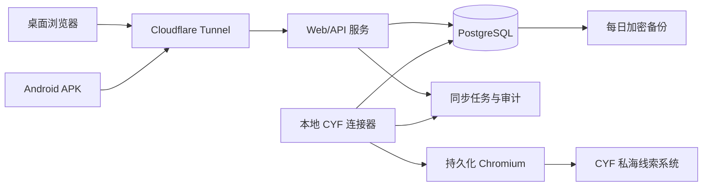

# CYF 线索工作台设计规格

- 日期：2026-09-16
- 状态：需求与架构已确认，等待实施计划
- 目标用户：5 人以内、权限相同的线索跟进人员
- 交付形态：响应式 Web 工作台 + Android APK

## 1. 项目目标

建立一个多人使用的工作台，将 `cyf.xiaojukeji.com` 当前司服公司的全部私海线索同步到本地数据库，并允许工作人员在工作台完成查看、外呼和跟进。工作人员提交的结果需要准实时写回 `cyf`。

系统同时管理仅存在于工作台的线下线索，并提供今日流入、外呼情况、线下线索状态、筛选和 Excel 导出能力。

## 2. 已确认的需求边界

### 2.1 首版包含

- 同步指定司服公司的全部私海线索，包括所有线索阶段和流程状态。
- 每 1 至 3 分钟自动同步，并支持用户手动触发同步。
- 在工作台新增外呼或跟进记录，写回 `cyf`。
- 在 `cyf` 和工作台同时变化时，以 `cyf` 为准。
- 新增、编辑和跟进仅存在于工作台的线下线索。
- 记录每次外呼时间、外呼状态、加盟意向、标签和备注，不自动拨号。
- 提供今日流入、外呼漏斗、线下线索状态、筛选和 Excel 导出。
- 每个使用者拥有独立账号，但权限相同。
- 记录关键操作的操作人和时间。
- 提供可安装的 Android APK，首版复用响应式 Web 页面。

### 2.2 首版不包含

- 自动拨号、录音、呼叫中心集成。
- 在工作台创建新的 `cyf` 司机线索。
- 将工作台线下线索自动写入 `cyf`。
- 精细化的数据权限和按队伍隔离。
- 完整的原生 Android 功能，例如后台推送、离线编辑和生物识别登录。
- 对 `cyf` 正式开放 API 的依赖。

### 2.3 后续扩展入口

- 如果后续获得创建 `cyf` 线索的正式接口或操作入口，增加“线下线索转为 CYF 线索”流程。
- 如果 Android 需要推送，利用 Capacitor 原生能力增加通知。
- 如果人员规模扩大，增加负责人、队伍、数据可见范围和审批规则。

## 3. 运行与部署约束

- 业务服务、数据库、连接器和备份全部运行在一台长期开机的办公 Mac 上。
- 手机和外部电脑通过 Cloudflare Tunnel 使用 HTTPS 访问 Web/API。
- 数据库和内部管理端口不对外开放。
- 使用 macOS 原生后台服务管理应用进程，不依赖 Docker Desktop。
- 外网可用性依赖办公 Mac、办公网络和 Cloudflare Tunnel。发生中断时，本地数据不丢失，恢复后继续补同步。
- Cloudflare 在中国大陆不同网络环境下可能存在可用性波动。该风险已接受，首版不额外搭建大陆公网中转服务。

### 3.1 技术基线

| 层级 | 选择 |
| --- | --- |
| Web | React + TypeScript + Vite |
| API | Node.js + TypeScript + Fastify |
| 数据库 | PostgreSQL |
| CYF 连接器 | Node.js + Playwright |
| Android | Capacitor |
| macOS 进程管理 | `launchd` |
| 外网入口 | `cloudflared` |
| 自动化测试 | Vitest + Playwright |

首版使用单一 TypeScript 代码库管理 Web、API 和连接器，共享字段类型和状态编码。Android 只构建 Web 静态资源并封装 APK。

## 4. 总体架构



### 4.1 Web 工作台

- 桌面和手机共用一套响应式前端。
- 提供工作台、线索列表、线索详情、线下线索、统计导出、同步状态和操作审计页面。
- 不直接访问 `cyf`，所有业务数据通过本地 API 获取。

### 4.2 API 服务

- 负责账号登录、会话、业务查询、统计、导出、同步队列和审计。
- 对浏览器和 APK 提供统一的 HTTPS 接口。
- 对数据库执行所有状态变更，保证外呼记录和待同步任务在同一事务中写入。

### 4.3 CYF 连接器

- 使用 Playwright 启动带持久化用户目录的 Chromium。
- 首次由使用者在办公 Mac 上人工登录 `cyf`，系统不保存账号密码。
- 在 `cyf` 页面上下文中调用网页正在使用的 HTTPS 接口，复用浏览器 Cookie。
- 定期检查登录状态。会话失效时停止写回，在同步状态页显示告警。
- 自动拉取和写回任务串行执行，避免并发提交造成状态覆盖。

### 4.4 PostgreSQL

- 保存工作台账号、线索、外呼记录、线下线索、同步任务、冲突和审计数据。
- 使用本地磁盘持久化，并由独立备份任务做加密备份。

### 4.5 备份任务

- 每日执行数据库逻辑备份。
- 默认写入外接磁盘并保留最近 30 天。
- 每月至少执行一次恢复验证。
- 不默认上传包含手机号的数据到第三方云存储。

### 4.6 Android APK

- 使用 Capacitor 封装移动端 Web 页面。
- APK 只负责承载统一页面和调用系统能力。
- 首版不实现独立的数据层，避免网页和 App 行为分叉。

## 5. 账号与权限

- 每个使用者有独立账号。
- 所有账号拥有相同的业务权限，可以查看和修改全部线索。
- 操作日志必须记录账号、时间、动作、对象、修改前后值和来源 IP。
- 首版支持邮箱或用户名加密码登录。
- 密码使用强哈希算法保存。
- 系统支持会话过期、登录失败限流和主动退出。
- 因服务直接暴露给公网，生产环境启用应用层 TOTP 二次验证。
- 不使用 Cloudflare Access 做人员身份认证，避免 APK WebView 登录发生跨域跳转和会话兼容问题。

## 6. 核心数据模型

### 6.1 users

| 字段 | 说明 |
| --- | --- |
| id | 内部 UUID |
| username | 登录名，唯一 |
| display_name | 显示名称 |
| password_hash | 密码哈希 |
| totp_secret_encrypted | 可选的 TOTP 密钥密文 |
| status | 启用或停用 |
| created_at | 创建时间 |
| last_login_at | 最后登录时间 |

### 6.2 leads

`leads` 使用统一主表保存 `cyf` 线索和线下线索。

| 字段 | 说明 |
| --- | --- |
| id | 内部 UUID |
| source | `cyf` 或 `offline` |
| cyf_lead_id | `cyf` 的 `leadId`，`cyf` 来源必填且唯一 |
| cyf_driver_id | `cyf` 的 `driverId` |
| city_id、city_name | 城市 |
| company_id、company_name | 司服公司 |
| name | 司机姓名；缺失时允许为空 |
| phone_masked | 页面返回的脱敏手机号 |
| phone_encrypted | 完整手机号密文，按需查询后保存 |
| birth_date | 生日；用于计算年龄 |
| first_driving_card_date | 首次取得驾驶证日期；用于计算驾龄 |
| age | 由生日计算 |
| driving_years | 驾龄 |
| flow_state | 招募流程状态 |
| lead_stage | 线索阶段 |
| channel_type | 渠道类型 |
| intention_area_id、intention_area_name | 期望做单区县 |
| driver_type | 司机类型 |
| in_company_time | 流入司服时间 |
| fall_public_days | 距离掉落公海天数 |
| lead_cycle_times | 线索流转次数 |
| lead_take_times | 手动认领次数 |
| lead_auto_times | 自动回流次数 |
| possible_join | 最新加盟意向 |
| latest_link_status | 最新外呼状态 |
| latest_follow_at | 最后跟进时间 |
| latest_follow_user | 最后跟进人 |
| follow_count | `cyf` 返回的跟进次数 |
| cyf_gmt_modify | `cyf` 最后修改时间 |
| source_digest | 远端归一化数据的哈希 |
| in_current_scope | 最近一次全量扫描是否仍在目标司服公司的私海范围内 |
| scope_last_seen_at | 最近一次在全量扫描中被看到的时间 |
| local_follow_status | 线下线索本地跟进状态 |
| created_by | 创建人；`cyf` 来源为空 |
| created_at、updated_at | 本地创建和修改时间 |

约束：

- `cyf_lead_id` 对 `source = cyf` 必须唯一。
- `cyf_driver_id` 是业务字段，不是数据库主键。
- 工作台内部始终使用 UUID 关联外呼记录和审计记录。

### 6.3 follow_ups

每次外呼或跟进保存一条不可变记录。

| 字段 | 说明 |
| --- | --- |
| id | 内部 UUID |
| lead_id | 线索 UUID |
| origin | `cyf` 表示远端历史，`local` 表示工作台提交 |
| cyf_follow_id | 远端跟进记录 ID；远端未返回时为空 |
| remote_digest | 远端跟进记录的归一化摘要，用于去重 |
| called_at | 外呼或跟进时间 |
| link_status | 外呼状态 |
| possible_join | 加盟意向 |
| remark_type | 标签编码 |
| remark | 用户填写的备注 |
| operator_id、operator_name | 操作人；远端历史没有本地账号时，`operator_id` 为空 |
| sync_state | `local_only`、`pending`、`synced`、`conflict`、`failed` |
| cyf_response | `cyf` 返回结果摘要 |
| sync_attempts | 写回尝试次数 |
| synced_at | 成功写回时间 |
| created_at | 本地创建时间 |

工作台列表中的最新外呼状态和最新加盟意向由该线索最新一条有效外呼记录推导。远端历史以 `origin = cyf` 只读镜像保存；本地提交以 `origin = local` 保存。

远端历史记录使用 `sync_state = local_only`，不创建 `sync_outbox` 任务。

### 6.4 sync_outbox

| 字段 | 说明 |
| --- | --- |
| id | 内部 UUID |
| follow_up_id | 对应外呼记录 |
| operation | 首版固定为 `follow` |
| payload | 写回请求 JSON |
| base_cyf_gmt_modify | 提交前本地记录的远端版本 |
| idempotency_key | 唯一幂等键，用于防止重复提交 |
| state | `pending`、`processing`、`succeeded`、`conflict`、`failed` |
| attempts | 已尝试次数 |
| next_retry_at | 下一次重试时间 |
| last_error | 最后错误摘要 |
| created_at、processed_at | 创建与完成时间 |

### 6.5 conflicts

| 字段 | 说明 |
| --- | --- |
| id | 内部 UUID |
| lead_id | 线索 UUID |
| follow_up_id | 被拒绝的本地外呼记录 |
| local_payload | 本地尝试提交的值 |
| remote_payload | 从 `cyf` 重新读取的值 |
| reason | 冲突原因 |
| resolved_by、resolved_at | 处理人和处理时间 |
| resolution | 保留本地记录、重新提交或放弃 |

### 6.6 sync_runs

| 字段 | 说明 |
| --- | --- |
| id | 内部 UUID |
| run_type | `scheduled_pull`、`manual_pull`、`outbox_write`、`session_check` |
| started_at、finished_at | 开始和结束时间 |
| state | `running`、`succeeded`、`failed`、`aborted` |
| fetched_count、inserted_count、updated_count | 拉取统计 |
| processed_outbox_count、failed_outbox_count | 写回统计 |
| error_code、error_summary | 失败摘要 |

### 6.7 audit_logs

记录登录、退出、新增、修改、查看完整手机号、导出、手动同步、连接器错误、冲突和账号管理操作。

### 6.8 settings

保存产品 ID、城市 ID、司服公司 ID、同步间隔、上次同步游标、连接器状态和备份配置。

## 7. CYF 对接设计

### 7.1 对接原则

- 不保存 `cyf` 账号密码。
- 通过持久化 Chromium 的用户目录保存登录 Cookie。
- 在 `cyf` 页面上下文中调用页面自身使用的 HTTPS 接口，避免自行拼接鉴权。
- 页面接口属于内部实现，不是正式开放 API。所有交互通过独立适配器封装，便于页面或接口变化时替换。
- 正式写回前先执行 Dry Run。首次真实写回应使用指定测试线索并由用户确认。

### 7.2 已验证的页面资源

| 用途 | 地址 |
| --- | --- |
| 工作台入口 | `https://cyf.xiaojukeji.com/dj/framework/pthome.node?id=dcompany_sub_236955601` |
| 私海线索页面 | `https://starsls.xiaojukeji.com/puhui/carbo/cluesPrivateListNew.node` |

页面需要的 Cookie 名称包括 `cookieAuthClientSid` 和 `cookieAuthClientAid`。系统只依赖浏览器会话，不把 Cookie 值写入业务数据库或日志。

### 7.3 初始配置

| 配置项 | 初始值 |
| --- | --- |
| productId | `261` |
| cityId | `513400` |
| companyId | `3577` |
| 同步范围 | 仅限该参数决定城市和司服公司在范围内。 |

全部配置存放在 `settings`，不得在业务代码中散落硬编码。

### 7.4 查询接口

接口：

```text
POST /puhui/carbo/cluesPrivateListNew.node?source=ext&actype=queryByPageFromEs
```

首版查询不限制 `stageList` 和 `flowStateList`，确保覆盖全部私海线索。基础请求示例：

```json
{
  "cityId": 513400,
  "companyId": 3577,
  "productId": 261,
  "pn": 1,
  "ps": 50,
  "operatorType": 1
}
```

同步策略：

- 每 2 分钟执行一次全量分页扫描。
- 每页 50 条，直到返回数量小于 50 或没有数据。
- 使用 `leadId` 作为第三方唯一键。
- 使用 `gmtModify` 和归一化数据哈希判断变化。
- 新增记录写入本地。
- 已存在记录更新远端字段。
- 远端删除或移出查询范围时，不物理删除本地历史；标记为 `not_in_current_scope`。
- 手动同步创建一条最高优先级任务，不等待下一次定时任务。

### 7.5 跟进历史接口

查询单条线索的跟进历史：

```text
POST /puhui/carbo/cluesPrivateListNew.node?source=ext&actype=queryLeadFollowPage
```

请求字段：

```json
{
  "leadId": 1000001,
  "driverId": 2000000000000001,
  "type": 0
}
```

该接口用于校正本地外呼历史。远端已有记录以只读方式镜像，本地新增记录保留在 `follow_ups`。

调用规则：

- 用户打开某条线索详情时，按需刷新该线索的远端跟进历史。
- 本地写回成功后刷新该线索的远端跟进历史。
- 全量同步阶段只读取列表中的 `followCount`，不逐条调用该接口。

### 7.6 完整手机号接口

```text
POST /puhui/carbo/cluesPrivateListNew.node?source=ext&actype=queryLeadMob
```

请求字段：

```json
{
  "productId": 261,
  "driverInfo": "2000000000000001"
}
```

规则：

- 列表默认只使用脱敏手机号。
- 用户在详情页明确点击“查看完整号码”时才请求完整值。
- 完整值加密保存，并写入审计日志。
- 完整号码不在普通日志、错误堆栈或前端缓存中持久化。

### 7.7 写回接口

接口：

```text
POST /puhui/carbo/cluesPrivateListNew.node?source=ext&actype=follow
```

基础请求：

```json
{
  "leadId": 1000001,
  "driverId": 2000000000000001,
  "linkStatus": 1,
  "possibleJoin": 1,
  "remark": "已加微信+用户计划周末到店",
  "nextVisitTime": "",
  "leadType": null,
  "operatorType": 1
}
```

字段规则：

- `leadId`、`driverId` 必须来自本地镜像的远端值。
- `linkStatus` 和 `possibleJoin` 是必填项。
- `remark` 在未选择标签时只保存备注；选择标签时保存为“标签名+备注”。
- `nextVisitTime` 首版固定为空字符串。
- `leadType` 仅在该线索远端返回该字段时携带。
- `operatorType` 固定为 `1`，表示从工作台环境提交。
- `cannotJoinType` 首版不由工作台采集，只有远端明确要求时才发送。

### 7.8 状态编码

外呼状态：

| 编码 | 名称 | 是否允许工作台手动提交 |
| --- | --- | --- |
| 0 | 未接通待二呼 | 是 |
| 1 | 已接通 | 是 |
| 2 | 二呼未接通 | 是 |
| 3 | 空号 | 是 |
| 4 | 流入后未外呼 | 否；用于统计和待办推导 |

加盟意向：

| 编码 | 名称 |
| --- | --- |
| 0 | 无意向 |
| 1 | 意向高 |
| 2 | 意向一般 |

备注标签：

| 编码 | 名称 |
| --- | --- |
| 0 | 已加微信 |
| 1 | 友商司机 |
| 2 | 驾龄不足 3 年 |
| 3 | 年龄不足 22 岁 |

线索阶段：

| 编码 | 名称 |
| --- | --- |
| 0 | 首次流入 |
| 10 | 二次分配 |
| 20 | 公海手动认领 |
| 21 | 公海主动回流 |

招募流程状态：

| 编码 | 名称 |
| --- | --- |
| -1 | 无流程 |
| 100 | 进行中 |
| 200 | 已完成（上岗） |
| 400 | 不通过 |

渠道类型：

| 编码 | 名称 |
| --- | --- |
| 1 | 线上 |
| 2 | 线下 |
| 3 | 付费 |

司机类型：

| 编码 | 名称 |
| --- | --- |
| 0 | 纯新 |
| 1 | 曾返聘 |
| 2 | 曾注销 |
| 3 | 曾返聘且曾注销 |

## 8. 同步与冲突规则

### 8.1 拉取流程

1. 连接器确认登录有效。
2. 分页读取指定司服公司的全部私海线索。
3. 规范化远端数据并计算来源摘要。
4. 按 `cyf_lead_id` 新增或更新本地镜像。
5. 对本地处于 `pending` 的记录执行写回。
6. 写回成功后重新拉取该线索，校正本地状态。
7. 更新同步运行记录和连接器健康状态。

### 8.2 写回流程

1. 用户在详情页保存外呼记录。
2. API 在同一事务中写入 `follow_ups` 和 `sync_outbox`。
3. 页面立即显示记录和“待同步”状态。
4. 连接器读取待处理任务。
5. 查询该 `driverId` 的最新远端记录。
6. 如果远端 `gmtModify` 与 `base_cyf_gmt_modify` 不一致，任务标记为冲突。
7. 如果版本一致，提交 `follow` 请求。
8. 接口返回成功后再次拉取该线索并更新本地。
9. 成功后标记为 `synced`；失败则按退避策略重试。

### 8.3 冲突处理

- `cyf` 永远优先。
- 冲突时不覆盖远端数据。
- 本地被拒绝的外呼记录保留为 `conflict`，不会静默丢失。
- 冲突页展示本地值和远端值。
- 使用者可以选择放弃本地记录，或基于最新远端版本重新提交。
- 所有处理动作写入审计日志。

### 8.4 重试策略

- 网络错误：指数退避，最长等待 10 分钟。
- 登录失效：不自动重试；等待人工重新登录。
- 接口明确拒绝：标记为失败并保留原始响应摘要。
- 未知错误：最多自动重试 5 次后转人工处理。
- 所有重试使用同一幂等键和同一条 `follow_up`，防止重复跟进记录。

## 9. 工作台功能

### 9.1 今日工作台

- 今日流入线索数。
- 待外呼线索数。
- 今日已外呼线索数。
- 今日接通数。
- 线下待跟进数。
- 同步失败或冲突数。
- 外呼漏斗。
- 最近 7 天或 30 天趋势。

### 9.2 线索列表

桌面端使用可筛选表格，手机端使用紧凑卡片。

筛选条件：

- 来源：全部、`cyf`、线下。
- 城市、司服公司、期望做单区县。
- 渠道类型、线索阶段、招募流程状态、司机类型。
- 外呼状态、加盟意向、标签、跟进人。
- 流入司服时间、创建时间、最后跟进时间。
- 是否待外呼、是否今日流入、是否接近掉公海。

操作：

- 查看详情。
- 跟进。
- 查看完整手机号。
- 手动触发全量同步。
- 按当前条件导出。

### 9.3 线索详情

- 展示基础信息、招募进度和资料审查进度。
- 展示 `cyf` 跟进历史和本地外呼历史。
- 展示最新同步状态和冲突提示。
- 可新增外呼记录。
- 完整手机号默认隐藏，明确点击后展示。

### 9.4 线下线索

- 支持新增、编辑和跟进。
- 使用工作台本地 UUID，不生成假的 `cyf` ID。
- 页面明确显示“仅本地”标识。
- 线下线索复用外呼记录、标签和备注模型。
- 可维护本地跟进状态：待跟进、跟进中、已跟进、无效、成交。
- 首版不写回 `cyf`。

### 9.5 统计与导出

- “今日流入”按 `in_company_time` 的本地自然日统计。
- “今日外呼”按 `follow_ups.called_at` 的本地自然日统计。
- “已呼”包含外呼状态 `0`、`1`、`2`、`3`。
- “未呼”使用远端外呼状态 `4` 或本地尚无外呼记录推导。
- “接通”使用外呼状态 `1`。
- “意向”按最新有效加盟意向统计。
- 导出使用创建时的筛选条件快照，生成 Excel 后提供限时下载。

## 10. Android 与响应式设计

- 使用同一域名和同一套 Web 页面。
- 手机底部提供工作台、线索、线下线索、统计、我的五个主入口。
- 列表卡片和详情表单支持手机安全区域和软键盘。
- APK 内嵌页面不可使用桌面悬停才能触发的操作。
- 首版在 APK 内嵌 WebView 完成登录。
- APK 签名和更新地址纳入部署配置。
- Android 的网络错误、登录过期和同步冲突必须显示可恢复的操作提示。

## 11. 安全设计

- Cloudflare Tunnel 只映射 HTTPS 主机名，不暴露 PostgreSQL 端口。
- Web/API 强制 HTTPS，启用安全 Cookie、CSRF 防护和输入校验。
- 账号密码使用 Argon2id 或等强度算法保存。
- 登录和敏感操作限流。
- 完整手机号字段使用应用层加密；密钥保存在 macOS Keychain。
- 完整手机号查看与所有 Excel 导出写审计日志。
- 日志不得记录 Cookie、密码、完整手机号或完整接口响应。
- 外接备份磁盘必须启用系统加密。
- 接口返回内容遵循最小必要字段原则。

## 12. 可观测性与故障处理

同步状态页展示：

- 连接器是否在线。
- Chromium 登录会话是否有效。
- 上次成功拉取时间和耗时。
- 上次成功写回时间。
- 下一次计划执行时间。
- 待处理、失败和冲突任务数量。
- 最近错误摘要和发生时间。

故障行为：

- Mac 断电或服务停止：Web 不可用；恢复后继续同步队列。
- `cyf` 登录失效：工作台可用，暂停写回并提示人工登录。
- `cyf` 接口失败：保留任务并重试，不丢失本地记录。
- Cloudflare Tunnel 中断：外网不可用；本地服务和连接器继续运行。
- 数据库损坏：从最近加密备份恢复，并重放安全的未完成业务任务。

## 13. 测试与验收

### 13.1 自动化测试

- 状态编码和字段映射单元测试。
- 冲突判断、重试策略和幂等逻辑单元测试。
- 使用脱敏真实响应建立接口契约测试。
- 使用假 `cyf` 服务测试分页、失败、超时、登录失效和冲突。
- Web API 集成测试。
- 响应式页面的桌面和手机视口测试。
- APK 在常见 Android 尺寸上的安装和核心流程冒烟测试。

### 13.2 真实环境验证

- 所有写回测试先使用 Dry Run 模式。
- 第一次真实写回使用一条指定测试线索，并由用户确认前后结果。
- 验证 `cyf` 页面能看到工作台提交的外呼状态、加盟意向和备注。
- 验证远端先修改时，本地写回被拒绝且进入冲突流程。
- 验证连接器重启后可以继续处理待同步任务。
- 验证备份可以在空数据库上完整恢复。

### 13.3 首版验收标准

- 能自动同步指定司服公司的全部私海线索。
- 能在 3 分钟内将远端新增或变化反映到工作台。
- 用户保存外呼记录后，页面立即显示，连接器在正常情况下 3 分钟内写回。
- 写回成功后，`cyf` 能正确显示同一外呼状态、加盟意向和备注。
- 冲突不会覆盖 `cyf`，且本地记录可追溯。
- 线下线索可以独立新增、编辑、跟进和统计，不会误写回 `cyf`。
- 今日工作台、外呼漏斗、线下状态和 Excel 导出结果与筛选条件一致。
- 用户能在手机流量下访问 Web；APK 能完成登录、查看、新增外呼和查看统计。
- 关键操作能够追溯到具体账号。

## 14. 风险与应对

| 风险 | 影响 | 应对 |
| --- | --- | --- |
| `cyf` 内部接口或页面结构变化 | 同步中断 | 独立适配器、契约测试、健康检查、页面兜底 |
| 登录会话失效 | 无法写回 | 停止提交、保留队列、醒目告警、人工重新登录 |
| 办公 Mac 或网络中断 | 外网和同步不可用 | 自动启动、任务持久化、恢复后补同步 |
| Cloudflare 在大陆网络不稳定 | 手机访问波动 | 已接受首版风险；保留迁移到云中转的接口抽象 |
| 重复写回 | 跟进记录重复 | 串行队列、幂等键、提交前版本校验 |
| 完整手机号泄漏 | 隐私风险 | 加密存储、最小展示、审计、日志脱敏 |
| 外接备份丢失 | 数据无法恢复 | 保留本地备份并定期验证恢复；后续可增加加密异地副本 |
| 线下线索无法进入 `cyf` | 业务流程不完整 | 首版明确为本地线索，后续获得正式创建能力后扩展 |

## 15. 已确认的架构决策

- 采用办公 Mac 一体化部署和 Cloudflare Tunnel。
- 业务数据库保存在办公 Mac，不额外部署业务云服务器。
- 采用 Cloudflare Tunnel，而不是 Tailscale 或大陆云服务器中转。
- 采用独立账号和操作审计，不采用共享账号。
- `cyf` 是冲突时的权威数据源。
- 首版同步全部私海线索，不限制线索阶段和流程状态。
- 线下线索首版仅保存在工作台。
- 外呼只记录结果，不自动拨号。
- Android 使用 Capacitor 封装同一套 Web 页面。
